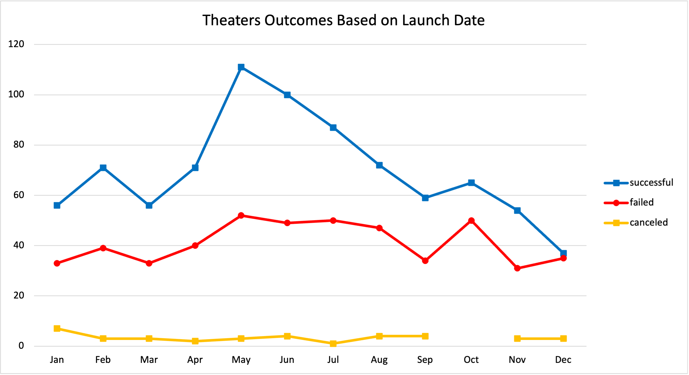
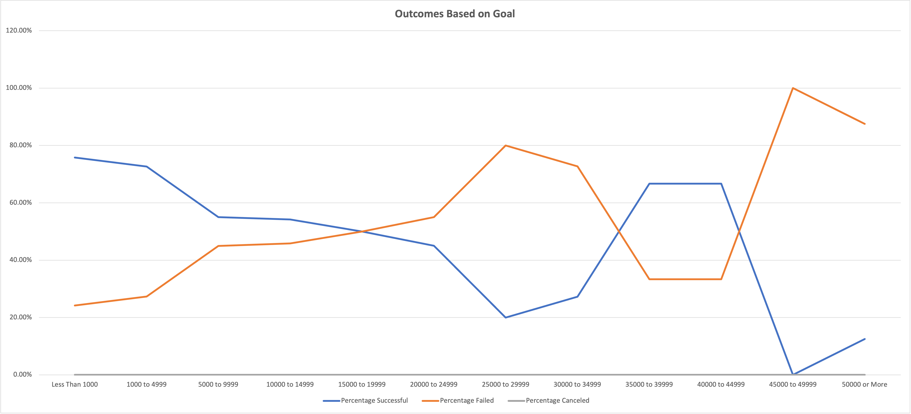

# Kickstarting with Excel

## Overview of Project

### Background
Louis is overseeing a play called "Fever" which raised a significant portion of its fundraising goal in a short time span. She wants to further understand the how the success of other fundraising campaigns is related to their funding goals and launch dates. 

### Purpose
In order to provide insights for Louise's inquiry. I use the 'Kickstarter' data set in order to analyze and then visualize the campaign outcomes relationship to funding goals and launch dates.

## Analysis and Challenges

### Analysis of Outcomes Based on Launch Date

It appears that May is a unique month for Theaters to have a launch date. May has the maximum amount of both 'Successful' and 'Failed' theater outcomes. However, the 'Successful' outcomes show significant growth relative to 'Failed' outcomes. We can conclude that May is a good month to launch in Theaters. This could be due to seasonality and/or other trends correlated with Theater attendees, such as the beggining of summer break for students. 

### Analysis of Outcomes Based on Goals

Generally, lower funding goals for plays appear to be more successful than plays with higher fundraising goals. However, this changes over various ranges as described in the chart below. This makes sense as the higher funding goals generally would mean more complex campaign. In addition, the higher tiers of funding may be ambitious pursuits.

Description of Chart:
- From $0 to $14,999 more plays were successful than failures.
- From $15,000 to $19,999 half of the plays were successful. 
- From $20,000 to $34,999 more plays were failures than successful.
- From $35,000 to $44,999 more plays were successful than failures.
- From $45,000 and above, more plays were failures than successful.

### Challenges and Difficulties Encountered

A challenge in the Theater Outcomes Analysis was the conversion of Unix time stamp codes to useable dates. I created columns S and T in the 'Kickstarter Data' tab of the excel based on lesson 1.1.3. Theses dates were then useable in the pivot table and chart.

Another challenge in the Outcomes Based on Goals Analysis for plays was the use of conditionals. Specifically, using comparison operators such as "<",">","<=", and ">=". I initially did not realize the order of the equal and greater than sign mattered and entered "=>". Of course this caused an error in my calculation. I found Microsoft excel source online and realized my syntax error. (See Source 1)

Source 1: See Link below for Web reference 
https://support.microsoft.com/en-us/office/calculation-operators-and-precedence-in-excel-48be406d-4975-4d31-b2b8-7af9e0e2878a

## Results

- What are two conclusions you can draw about the Outcomes based on Launch Date?
    
   * May would be a good month for a launch date in theaters. December would be the worst month to have a launch date for theaters. 

- What can you conclude about the Outcomes based on Goals?

   * Any campaigns for plays with over a $40,000 goal of funding have a low success rate. Campaigns for plays with under a $5,000 goal of funding have a high success rate.

- What are some limitations of this dataset?

   * The data covers a 10 years time period but only up until Q1 of 2017. This data may no longer be indicative of current trends in the past 5 years, especially in the Post-Covid environment. 

- What are some other possible tables and/or graphs that we could create?

   * I would like to replicate the Outcomes based on Launch Date Analysis for Theaters using the Parent Category 'Film & Video'. I suspect I would find a similar trend where the summer months are the best times to Launch 'Film & Video' campaigns. I also would create a chart to compare funding across parent categories to understand which catagroies recieve the most or least funding.
